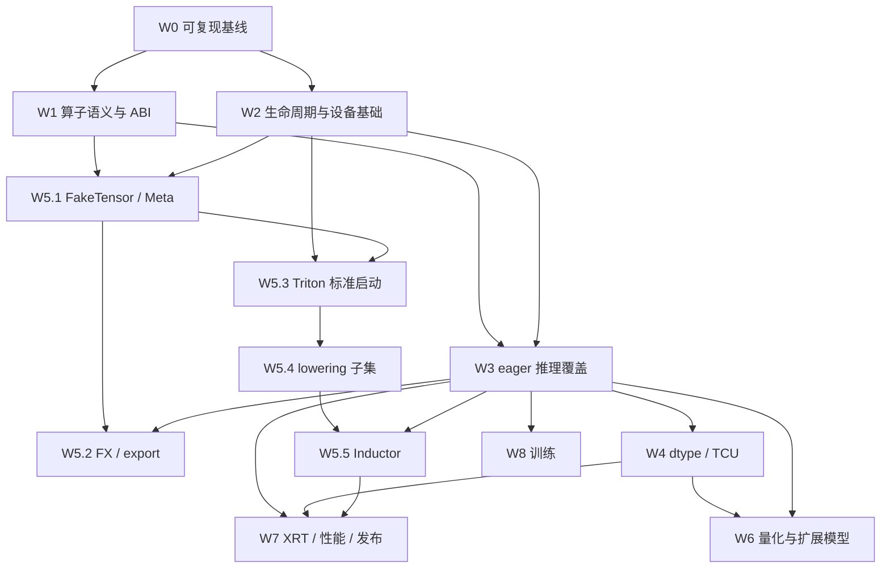

# PyTorch 支持 Vortex：现状审计与后续实施计划

> **状态说明（2026-09-22）**：本文件是历史拆分版，统一执行计划已迁移到
> [`plan.md`](plan.md)。其中的初始复选框没有反映 P5.3–P5.15 的后续实现；请以
> `plan.md` 的状态和依赖顺序为准。本文件保留详细设计背景和原始验收要求。

更新日期：2026-09-17。代码基线：`d8458f058`。本文原为拆分后续开发工作的计划，当前统一入口是 `docs/mydocs/plan.md`；涉及模块重定位、编译器后端等重大架构决策时，另在 `docs/proposals/` 提交设计方案。

## 1. 当前结论与计划边界

当前 Vortex 已有 **PyTorch PrivateUse1 设备后端原型、FP32 eager 算子子集和 MiniResNet 前向验证资产**。它已经超过“仅能分配设备张量”的阶段，但距离可供普通 PyTorch 模型可靠使用的后端仍有明显差距。

最先要解决的是已注册算子的语义错误、异步内存生命周期、参数 ABI 和全局 dispatch 干扰。之后才适合扩大算子覆盖、接入 `torch.compile`、优化 TCU 性能。否则增加模型只会扩大错误影响面。

建议按以下顺序交付：

1. **可信的 FP32 eager 基线**：已有算子符合 PyTorch 语义，错误输入可诊断，测试与环境可复现。
2. **可用的单设备推理后端**：张量布局、stream/event、RNG、序列化和常用算子齐备，CNN 与小型 Transformer 可运行。
3. **可用的图执行与编译路径**：分别验证 FakeTensor/FX、export、Triton 标准启动和 Inductor；逐层形成真实设备执行证据。
4. **低精度与 FPGA 性能交付**：FP16/BF16、TCU、INT8/W4A16、XRT 全集成测试、安装包与性能报告。
5. **训练及更广生态**：Autograd、优化器、AMP 训练、分布式等单独验收，不纳入第一版推理可用性的前置条件。

本文是代码审计和工作计划，**本次没有重新构建或运行 Vortex 测试**。下文“代码确认”来自当前源码；“历史验证”来自仓库已有报告；“风险/待复现”必须由后续最小测试确认，不能记作本次实测结果。所有工作项初始均为未完成。

## 2. 已有资产与真实支持边界

### 2.1 软件路径

```text
PyTorch eager / ATen PrivateUse1
  └─ torch-vortex C++ extension
       └─ libhip_vortex → vortex2.h → simx / rtlsim / xrt

sw/dl：BLAS / DNN / PRIM / attention / LLM / Mamba / RNG / quant
  └─ 当前独立通过 vortex2.h 使用；多数尚未接入 torch-vortex

Triton AST → TTIR → 部分 TTIR-to-C 转换 → VOLT → vxbin
  └─ 现有端到端脚本手动使用 HIP binding 加载和启动
     标准 kernel[grid](...) 与 PyTorch/Inductor 集成尚未完成
```

PyTorch 使用 `device="vortex"`，并不因为底层实现了一部分 HIP API 就自动获得 PyTorch ROCm/CUDA 后端的算子、编译器或生态兼容性。继续沿 PrivateUse1 外置后端路线推进。上游接入范围包括算子、generator、guard 等多个组件，设备重命名只是入口。[PyTorch PrivateUse1 接入指南](https://docs.pytorch.org/tutorials/advanced/privateuseone.html)

### 2.2 当前能力表

| 领域 | 当前代码与资产 | 尚不能据此宣称的能力 |
|---|---|---|
| 设备注册 | `rename_privateuse1_backend("vortex")`、allocator、DeviceGuard、最小设备模块 | 完整 `torch.vortex`、多设备、通用 accelerator 接口兼容 |
| 内存 | `hipMalloc/hipFree`，CPU↔Vortex 与 Vortex↔Vortex 字节复制 | 通用 `copy_`、安全异步回收、缓存分配器、pinned memory 集成 |
| 基础算子 | empty、empty_strided、copy、fill、zero、add、mul、view、relu | 任意 stride、broadcast、dtype promotion、完整 alias/autograd 语义 |
| CNN/矩阵 | convolution、推理 BatchNorm、pool、mm、linear、addmm | 完整 ResNet-18、任意 batch、group/depthwise conv、所有参数组合 |
| 模型测试 | 7 个基础测试 + 2 个 MiniResNet 测试；历史报告记录 SimX RV64 通过 | 全模型精度、训练、性能、XRT/FPGA 已通过 |
| DL 库 | `sw/dl` 已有 11 个 host 模块及相应 kernel/测试目录 | 这些算子已自动注册为 PyTorch ATen 算子 |
| 低精度 | DL 库已有 FP16/BF16 GEMM、量化与低比特原型 | PyTorch 半精度模型可用、torchao 可用、已经获得 TCU 加速 |
| Triton | 部分 elementwise、轴 0 reduction 可生成设备镜像；有 vecadd/rowmax/softmax 脚本 | 完整 Triton、`tl.dot`、标准 JIT launcher、Inductor 支持 |
| 编译/导出 | 尚无可用的完整 torch-vortex 图编译链；历史记录有 FakeTensor 失败 | `torch.compile` 成功、export 后可在 Vortex 部署 |
| 工程化 | import 时在线编译 C++ 扩展、依赖源码树和本机 build 路径 | 独立 wheel/SDK、新环境可安装、正式兼容版本矩阵 |

本机包元数据读取结果：Python `3.10.21`、torch `2.14.0+cpu`、Triton `3.8.0`，该环境未发现 torchvision。它们是**环境观察值，不是已验证兼容矩阵**。旧文档讨论 torch 2.4/2.5，必须重新核对实际版本与接口，不能继续据旧描述推断当前可用性。

主要证据：

- [PyTorch Python 入口](../../torch-vortex/torch_vortex/__init__.py)、[C++ 注册与算子](../../torch-vortex/src/vortex_ext.cpp)、[基础 kernel](../../torch-vortex/kernels/ops.hip)、[DNN kernel](../../torch-vortex/kernels/dnn.hip)、[kernel 构建规则](../../torch-vortex/kernels/Makefile)。
- [基础测试](../../torch-vortex/tests/test_basic.py)、[MiniResNet 测试](../../torch-vortex/tests/test_resnet.py)、[历史后端报告](p5_01_torch_vortex.md)、[历史 ResNet 报告](p5_02_resnet_eager.md)、[历史模型报告](p7_01_model_reports.md)。
- [DL 库](../../sw/dl/Makefile)、[DL CI 配置](../../ci/testcases/dl.yaml)、[后续模块历史报告](p3_03_attn_llm_mamba_rng.md)。
- [Triton compiler](../../triton-vortex/triton_vortex/compiler.py)、[TTIR 转换器](../../triton-vortex/triton_vortex/ttir_to_c.py)、[Triton driver](../../triton-vortex/triton_vortex/driver.py)、[vecadd 编译执行脚本](../../triton-vortex/tests/e2e_vecadd.py)。

## 3. 必须优先处理的问题

优先级定义：**P0** 为错误结果、越界/生命周期风险或基础集成阻断；**P1** 为单设备推理必需；**P2** 为编译、性能和产品化；**P3** 为训练及扩展生态。这里的优先级不对应旧全栈计划中的 P0～P7 阶段编号。

### 3.1 正确性与运行时问题

| 编号 | 优先级 | 代码事实或风险 | 影响与必要验证 |
|---|---|---|---|
| F01 | P0 | `relu_impl` 把输入地址传给原地 kernel，返回输入；`aten::relu` 注册为非原地算子 | 分支复用输入时可能改变另一条分支；应区分 `relu`/`relu_`，检查 storage、输入不变和版本计数 |
| F02 | P0 | `addmm_impl` 调用 `linear_impl(mat1, mat2, self)`，后者计算 `mat1 @ mat2.T` | 非方阵可能错误拒绝；方阵可能静默算错；独立实现正确转置与 alpha/beta 语义 |
| F03 | P0 | `tv_bn_affine_kernel` 用 `plane=total/c=N*H*W` 推导通道，正确空间跨度应为 `H*W` | `N>1` 且通道参数不同会错误取通道；现有 batch=1、默认 BN 参数不足以发现 |
| F04 | P0 | `copy_impl` 直接按目标字节数 `hipMemcpy`，没有 dtype/shape/stride/broadcast 处理 | 类型转换会变成位模式复制；较小源可能读越界，非连续张量可能错拷；先加严格边界，再实现所需语义 |
| F05 | P0 | `view_impl` 新建 TensorImpl 并设置 contiguous sizes，没有元素数、`-1` 推导、storage_offset 处理 | 可能产生非法 view 或丢失偏移；alias/version counter 也需按官方 view 路径核对 |
| F06 | P0 | 全局注册 `aten, BackendSelect` 的 empty/empty_strided，所有非 Vortex 分支均调用 CPU factory | 会干扰 Meta/FakeTensor 及其他设备的原生工厂分发；移除全局强制 CPU 路由并验证其他设备不受影响 |
| F07 | P0 | PyTorch host 参数结构固定 `uint64_t`；基础 device 结构使用 `uintptr_t`；Makefile 手填 RV32/RV64 参数大小 | RV32 路径不一致，RV64 也有 metadata 大于真实结构的迹象；需编译期 ABI 校验，避免 host 参数越界读取 |
| F08 | P0 | kernel launch 异步返回；allocator 直接 hipFree；BN scratch 在 launch 后立即 hipFree | queue 保留 kernel 和参数副本，并不等于保留参数中裸地址指向的 Tensor；存在释放/复用早于执行的风险，须做队列延迟和重分配复现 |
| F09 | P0 | conv/pool 输出尺寸使用无符号算术；多个元素数转为 uint32；部分空张量会形成 grid=0 | 非法窗口、stride=0、溢出、空输入可能异常或产生错误分配；统一边界与范围检查 |
| F10 | P1 | ReLU 用 `x > 0 ? x : 0`；max pool 初始值为有限 `-3.4e38f`，比较会忽略 NaN | NaN 和全 `-Inf` 等输入不符合应有语义；需要特殊值测试，而非只测随机有限数 |
| F11 | P1 | BN 每次把 running_var 复制到 CPU，计算 sqrt，再复制回设备 | “未触发 dispatcher CPU fallback”不代表“全部数值计算在设备”；增加 host 计算与传输统计并移除该往返 |
| F12 | P1 | AutogradPrivateUse1 使用全局 fallthrough，没有完整 backward 实现 | forward 成功不能作为训练支持证据；先明确推理边界，再逐个注册/验证梯度 |

F02 的语义标准是 `beta * input + alpha * (mat1 @ mat2)`；`beta=0` 时应忽略 input 中的 NaN/Inf。[torch.addmm 官方接口](https://docs.pytorch.org/docs/main/generated/torch.addmm.html)

F07 的静态审计示例：当前 `ConvArgs` 为 4 个 64 位地址加 14 个 uint32，普通 RV64 ABI 下应为 **88 字节**，而 torch kernel Makefile 填 **104**；`PoolArgs` 为 2 个地址加 13 个 uint32，按 8 字节对齐应为 **72 字节**，Makefile 填 **80**。这是按源码字段和 ABI 对齐推导的结果，后续必须用 host/device 编译器的 `sizeof/alignof/offsetof` 验证。`sw/dl` 也存在独立手填尺寸，必须一起审计；不能照抄旧报告中的“已修正大小”。

完整 ResNet 的阻塞也不只是仿真耗时：当前 conv 为一个输出通道暂存全部输入通道的权重，LMEM 需求为 `CI*KH*KW*4`。例如 `CI=512` 的 3×3 FP32 卷积需要 **18 KiB**，超过默认 `VX_CFG_LMEM_LOG_SIZE=14` 对应的 **16 KiB**。缩小输入图像不会减少这部分权重暂存需求，必须改变分块算法或使用经验证的资源配置，不能仅以“小分辨率能跑”推断完整模型可用。

### 3.2 集成、性能与工程问题

| 编号 | 优先级 | 当前问题 | 需要完成的工作 |
|---|---|---|---|
| F13 | P1 | `torch.vortex.is_available` 是恒为 True 的 property；缺 current_device、RNG 等接口 | 改为真实能力查询和正确的方法接口，补 hooks、初始化失败、无设备与非法 index 行为 |
| F14 | P1 | guard 总返回默认流；exchangeStream 存储值与 getStream 不一致；kernel 都传 nullptr stream | 建立真正的线程局部 current stream，统一 HIP/ATen/Triton 流身份 |
| F15 | P0/P1 | 多镜像固定地址冲突：HIP 编译器使用 `STARTUP_ADDR=0x80000000`，common module loader 按镜像 min_vma 预留 | torch、DL 各库与 Triton JIT 无法可靠共存；根因涉及编译/链接及公共 runtime，不能只归因于 SimX |
| F16 | P1 | torch-vortex 重复实现 DNN/GEMM，未复用 sw/dl；后者多处使用全局状态 | 先修 ABI/多模块/生命周期，再统一 kernel 与 device/context/stream 管理，避免两套语义继续分叉 |
| F17 | P1 | FP32、contiguous、同形 add/mul、2D linear 等限制；缺 norm、attention、embedding 的 ATen 桥接 | 按模型 trace 补通用张量基础和高频算子，已有 DL 实现需复用但仍要做 PyTorch 语义验收 |
| F18 | P2 | BLAS 已有低精度输入，但 `vx_blas_kernel_name` 仍报告 FPU 变体；PyTorch kernel 也为 FP32 | 先实现 dtype 支持，再接 TCU 分派；使用实际 capability 查询而非假定硬件开启 |
| F19 | P1/P2 | Triton 标准 launch 明确抛 NotImplementedError；active torch device 返回 CPU；target/资源值硬编码 | 补 launcher、设备张量指针、stream、属性查询、cache key 与错误传播 |
| F20 | P2 | TTIR 转换器只处理白名单；不支持完整二维布局、控制流和 dot；没有 Inductor 设备接入 | 分开推进可验证的子集扩展、正式 lowering 与 Inductor 集成 |
| F21 | P0/P1 | configure 的目录清单不含 torch-vortex/triton-vortex；无 torch CI 类别；部分脚本含个人绝对路径 | 先支持干净 build，再加入 CI；DL 部分 Makefile 直接引用本地 main.cpp，也需核对生成树源文件路径 |
| F22 | P1/P2 | import 在线编译、源码树依赖、README 引用不存在的 `_ext.py` 和 fallback_counter | 建立可安装包、真实能力表、稳定日志，修正文档与代码不一致 |
| F23 | P1 | 历史报告记录退出析构竞态，但没有足够的根因及当前复现结果 | 独立子进程测试正常退出、异常退出与未完成队列；查资源销毁次序，不把组合运行通过当修复 |

额外纠偏：`VX_CAPS_TCU_DTYPES`、原生 HIP、async free、部分 DL 库与 Triton codegen 已经存在，计划应完善其语义和接入，不能继续将它们全部列为“从零开发”。证据见 [vortex2.h](../../sw/runtime/include/vortex2.h)、[HIP runtime](../../sw/hip/src/hip_vortex.cpp)、[queue](../../sw/runtime/common/queue.cpp)、[module loader](../../sw/runtime/common/module.cpp)、[HIP 编译包装器](../../ci/hipcc_vortex.py)。

## 4. 工作拆分

每项以一个可独立评审的变更或一组紧密相关变更交付。完成标准必须包含可重复的测试结果；模型“能跑完”不能代替算子语义与设备执行证明。表述中的拟新增文件/入口均为待实现内容。

### W0：建立可重复基线与测试入口（P0）

**W0.1 环境与版本锁定**

- [ ] 记录 Python、torch/torchvision/Triton、C++ ABI、VOLT、TOOLCHAIN_REV、驱动、XLEN、CONFIGS 与源码 commit。
- [ ] 首先复测本机已安装 torch 版本，再选定正式支持的一组依赖并锁定；不要以旧文档推断兼容，也不要无条件跟随上游 main。
- [ ] 为 RV64 基线和 TCU 变体分别建立 build 目录；读取现有 `ci/dl_config_matrix.json` 与 canonical regression 配置后确定组合。
- **交付/验收**：环境 manifest、明确支持/未验证版本表；任何测试结果能定位到同一套依赖、镜像与配置。
- **涉及**：`torch-vortex` 包配置、CI 环境、`VERSION`、现有 DL 配置；不要求立即升级工具链。

**W0.2 修通干净 out-of-tree 构建**

- [ ] 更新 configure 的目录生成策略，保证 Python 包、C++/HIP 源码引用与 kernel Makefile 在 build 树中可用。
- [ ] 为 torch kernel、host extension 和 runtime/hip 提供明确依赖；核对 DL 测试的 main.cpp 路径，消除手工拷贝才成功的隐含条件。
- [ ] cache/output 位于对应 build 目录，加入配置、ABI 和源码变化的失效规则。
- **交付/验收**：新的空 build 目录，仅执行文档中的 configure/build/test 命令即可运行基础测试；源码树不产生构建物。
- **依赖**：W0.1。涉及 `configure`、Makefiles、`torch_vortex/__init__.py`。

**W0.3 测试分层与证据采集**

- [ ] 将现有 9 个测试复测为历史资产基线；增加算子、runtime、模型、编译四层分类及明确超时。
- [ ] MiniResNet 推理使用 `eval()` 加 `inference_mode()`；另设训练不支持的负例，不靠 eval 隐式关闭梯度。
- [ ] 初始加入设备 launch、H2D/D2H 字节数、显式 host 数值工作、同步和分配计数；区分加载权重、稳态前向、取回结果三个区间。
- **交付/验收**：机器可读结果和失败复现命令；测试能发现 BN host 工作、意外拷贝及正常结果后的异常退出。
- **依赖**：W0.2；观测能力后续在 W7.1 扩展。

### W1：修复已注册算子的语义（P0，最高优先级）

**W1.1 ReLU 的非原地语义与特殊值**

- [ ] 非原地 `relu` 分配输出，保留输入；按需求单独提供 `relu_` 并遵守 mutation/version 语义。
- [ ] kernel 保留正确 NaN/Inf 行为；测试两个消费者共享同一输入的残差分支。
- **验收**：输入逐元素不变、输出不与输入存储混淆；`[-Inf, -1, -0, 0, 1, Inf, NaN]` 与 CPU 参考一致，必要时单独检查符号位。
- **涉及/依赖**：`vortex_ext.cpp`、`ops.hip`；W0.2。

**W1.2 addmm/mm/linear 语义**

- [ ] 将 mm、带转置的 linear、addmm 的参数解释分清；addmm 严格实现 `beta*self + alpha*(mat1@mat2)`。
- [ ] 补 alpha/beta、bias broadcast 以及空 M/N、K=0 的语义；不支持组合必须在 launch 前明确拒绝。
- **验收**：`(M,K,N)=(2,3,5)` 和非对称方阵、bias 向量/矩阵、alpha/beta 非 1、beta=0 且 self 含 NaN；覆盖 functional 和所承诺的 out 变体。
- **涉及/依赖**：`vortex_ext.cpp`、`dnn.hip`，后续与 W3.1 合流；W0.2。

**W1.3 BatchNorm 通道索引与 host 往返**

- [ ] 参数中明确传入空间跨度或 N/C/H/W，修正 `channel=(idx/(H*W))%C`；审计 sw/dl 对应实现。
- [ ] 将 rstd 计算移到设备或与 affine 融合；不引入无法跟踪 running stats 变化的缓存。
- [ ] 验证 optional affine、参数 dtype/device/shape、eps 及未支持 training 模式的明确错误。
- **验收**：N=1/2/3、非正方形输入、每通道不同的 mean/var/weight/bias；稳态前向无 BN 参数 D2H/H2D 往返，输出与 CPU 参考一致。
- **涉及/依赖**：`vortex_ext.cpp`、`dnn.hip`、`sw/dl/src/dnn_*`；W1.7、W2.1 确保参数与 scratch 安全。

**W1.4 copy/to 的布局与类型语义**

- [ ] 先限定安全 fast path：同 dtype、合法设备对、兼容形状、连续存储且范围有效；其他组合显式报错，消除裸字节错拷。
- [ ] 再实现模型必需的 dtype conversion、broadcast copy、非连续源/目标和 storage_offset；区分 D2D、H2D、D2H。
- [ ] 处理重叠与 self-copy，逐步接入 pinned memory/non_blocking；异步发布必须与 W2.1/W2.2 联动。
- **验收**：转置张量、带偏移 slice、大小 0、单元素广播、float32↔float16/bfloat16/int64、不同元素大小、非法跨设备对；不能只以 roundtrip 位相同为标准。
- **涉及/依赖**：`vortex_ext.cpp`、copy/cast kernel、HIP memory API；W0.2。

**W1.5 view/reshape 与 alias**

- [ ] 复用锁定版本的 ATen view 构造与形状推导机制，处理 `-1`、元素数一致性、storage_offset、stride 和共享版本状态。
- [ ] 区分 view 必须共享存储与 reshape 必要时复制；不把所有 reshape 都强制当 contiguous metadata 操作。
- [ ] 为后续 transpose/permute/slice/as_strided 建立有边界的统一张量布局实现。
- **验收**：合法/非法 `view(-1, ...)`、零元素、非零 offset、非连续输入、view 修改传播、版本计数以及越界拒绝。
- **涉及/依赖**：`vortex_ext.cpp`；W1.4 支持需要实际复制的 reshape。

**W1.6 工厂注册与全局 dispatch 隔离**

- [ ] 按锁定版本的 dispatcher 规则实现 PrivateUse1 factory，移除当前非 Vortex→CPU 的全局劫持。
- [ ] 保留 CPU/Meta/可用其他设备原有 factory 路由；正确验证 device index、layout、memory_format、pin_memory 和 dtype 默认值。
- [ ] 对动态 SymInt 采用 meta/shape 路径；不能在符号推导阶段一律 `expect_int()` 强制具体化。
- **验收**：导入前后 CPU 和 Meta empty/empty_strided 行为一致；Vortex 非法 index 可读报错；FakeTensor 创建无真实分配或 HIP launch。
- **涉及/依赖**：`vortex_ext.cpp`、设备模块；W0.1/W0.2。参考 [官方算子注册说明](https://docs.pytorch.org/docs/stable/accelerator/operators.html)。

**W1.7 参数 ABI 与 metadata 单一来源**

- [ ] host/device 共用参数布局定义，统一地址宽度、大小、自然对齐和字段偏移；区分 host 指针与设备地址。
- [ ] 用目标编译器导出/检查 metadata；为各结构添加有意义的 `sizeof/alignof/offsetof` 断言，删除手工猜测的 args_size。
- [ ] 一并审计 torch、sw/dl、Triton 三条路径和所有镜像入口；校验 args_size、所需 ISA、block/LMEM。
- [ ] 若 RV32 未完成，先明确将 torch backend 限定 RV64 并在初始化拒绝不匹配镜像；随后独立完成 RV32，不能保留表面可选但 ABI 错误的分支。
- **验收**：各入口 host/device/metadata 三者一致；错误 XLEN、错误配置、损坏 metadata 在运行前失败；禁止从 host 参数块越界复制。
- **涉及/依赖**：共享参数头、kernel Makefiles、`ci/hipcc_vortex.py`、`vxbin.py`、module API；W0.1。跨 sw/sim/hw 的 ABI 放 `sw/common`。

**W1.8 空张量、尺寸和资源边界**

- [ ] conv/pool 用有范围检查的形状运算，拒绝零 stride、负 padding、不合法窗口和截断溢出；检查参数数组长度。
- [ ] 明确零元素不 launch、K=0 的结果；修 max pool 的 `-Inf` 初值和 NaN 传播。
- [ ] 检查静态/动态 LMEM、block、grid 和硬件能力；大型 conv 改为分块，不把全部权重都塞入 LMEM。
- **验收**：边界输入的结果或错误与已承诺的 PyTorch 语义一致；资源超限可读报错，不能出现 hang/OOM 级误分配。
- **涉及/依赖**：`vortex_ext.cpp`、`dnn.hip`、能力查询；W1.7。

### W2：设备、内存、stream 与模块基础（P0/P1）

**W2.1 异步内存生命周期**

- [ ] 复现 launch→删除输入/中间 Tensor→大量重新分配，以及 BN scratch 立即释放；确认 buffer 被实际回收的时点。
- [ ] 定义普通 hipFree 与 stream-ordered free 的契约，优先修正底层 HIP/runtime 语义；PyTorch allocator 跟踪分配的使用流和完成事件。
- [ ] 实现安全延迟回收、跨流 record_stream、OOM/异常清理与 allocator 统计；异常路径使用 RAII 管理 scratch。
- **验收**：人为延迟执行并强制地址复用时结果正确；无 use-after-free/泄漏；跨流使用有事件依赖。性能优化前先证明生命周期正确。
- **涉及/依赖**：allocator、`hip_vortex.cpp`、queue/buffer/event、`tests/runtime/test_async_free.cpp`；W0.2。

**W2.2 真实 stream/event 与 device guard**

- [ ] 当前 device/stream 状态按线程保存，get/exchange/restore 一致；所有算子从 guard 获取实际 HIP stream。
- [ ] 提供创建、默认流、事件 record/wait/query/synchronize 和必要的 Python 包装；为无多设备能力保留明确的单设备行为。
- [ ] 明确多软件队列与实际硬件并发能力区别，使用现有 CP capability 报告，不能把 API 数量当作 overlap 证明。
- **验收**：嵌套上下文恢复、两线程互不干扰、两流事件依赖正确；只有计时实验证明后才宣称 copy/compute overlap。
- **涉及/依赖**：Guard、Python device module、HIP queues；W2.1。参考 [PyTorch Guard 接口](https://docs.pytorch.org/docs/main/accelerator/guard.html)。

**W2.3 设备模块、hooks、初始化及退出**

- [ ] 实现可调用的 is_available、current_device、device_count、set_device、properties、synchronize；基于真实 runtime 查询。
- [ ] 按支持版本补 `PrivateUse1HooksInterface` 所需钩子；初始化线程安全、可诊断，明确 fork 后行为。
- [ ] 处理部分初始化失败回滚、未完成任务、kernel/module/context 的销毁次序，复现并修复历史退出竞态。
- **验收**：无驱动、无设备、错版本库、重复导入、独立脚本、pytest 单文件、异常退出均有稳定行为；成功用例进程返回 0。
- **涉及/依赖**：Python 入口、C++ extension、HIP/runtime 生命周期；W2.1/W2.2。参考 [Accelerator Hooks](https://docs.pytorch.org/docs/main/accelerator/hooks.html)。

**W2.4 同进程多模块共存**

- [ ] 最小复现同时加载两个不同 vxbin，并交替执行；覆盖 torch 镜像、一个 DL 镜像和两个不同 Triton JIT 镜像。
- [ ] 在 proposal 中评估链接地址分配与可重定位镜像两种方案；完整考虑绝对引用、入口 PC、符号、rodata/bss、缓存与卸载。
- [ ] 落实编译/链接—metadata—公共 loader 的统一契约；若需工具链修改，按组件→prebuilt→Vortex 的顺序发布。
- **验收**：同进程多模块共存、交替 launch、引用存活时卸载安全、卸载后地址可复用；SimX 和 XRT 都验证。现有单镜像合并只作为当前限制描述，不能替代此项验收。
- **涉及/依赖**：`hipcc_vortex.py`、链接脚本、vxbin 格式、module loader、module tests；W1.7/W2.1。

### W3：把算子原型变成 PyTorch 推理能力（P1）

**W3.1 统一 torch-vortex 与 sw/dl**

- [ ] 明确分层：ATen 负责 schema/shape/dtype，DL 库负责 kernel 分派，HIP/runtime 负责设备资源；kernel 算法只维护一份。
- [ ] 为库提供与调用方一致的 device/context/queue 生命周期；逐步替换全局 singleton，禁止各自新建不相容的设备上下文。
- [ ] 先对照测试再迁移 mm/conv/norm；同步修复共享 kernel 中的对应问题，避免将已知错误从一层搬到另一层。
- **验收**：ATen 与独立 DL API 对相同输入选择可追踪的同源 kernel，stream 一致，数值与 ABI 测试通过。
- **涉及/依赖**：torch C++ 分模块、`sw/dl/include`、host 层；W1、W2.2、W2.4。

**W3.2 通用 Tensor 与基础算子覆盖**

- [ ] 按真实模型 op trace 制作 overload/dtype/layout/shape 支持矩阵；优先补 cast、clone/contiguous、transpose/permute、slice/select、expand、arange。（`cat`/`stack` 的连续 FP32 基础路径已交付，见 [p5_12_cat_stack.md](p5_12_cat_stack.md)。）
- [ ] 补 broadcast add/mul/sub/div、标量 alpha、sum/mean/max/argmax、exp/log/rsqrt、GELU/SiLU，以及模型真正需要的 in-place/out overload。（其中 `sum/mean/max/argmax` 的 FP32 基础路径已交付，见 [p5_10_argmax.md](p5_10_argmax.md)；`bmm` 已交付，见 [p5_11_bmm.md](p5_11_bmm.md)；`cat`/`stack` 已交付，见 [p5_12_cat_stack.md](p5_12_cat_stack.md)；`gather`/`scatter`/`index_add` 基础路径已交付，见 [p5_13_gather_scatter.md](p5_13_gather_scatter.md) 与 [p5_15_index_add.md](p5_15_index_add.md)；其余 overload/dtype 仍待补齐。）
- [ ] 同时支持 FP32 数据、bool mask、int64 索引等基础类型；对 unsupported schema 明确报错，不新增自动 CPU fallback。
- **验收**：按目标算子抽取 OpInfo/参数化一致性测试；覆盖标量、broadcast、非连续、空维度及 dtype promotion。支持矩阵必须由测试支撑。
- **依赖**：W1.4/W1.5/W1.8；可在 DL 统一过程中按族交付。

**W3.3 CNN eager 可用性**

- [ ] 扩展 conv 的 groups/depthwise、dilation、较大通道与 kernel；先用 trace 确定真实需要的变体。
- [ ] 完善 max/avg/adaptive pool、BN optional affine、linear 前导 batch 维；支持 torchvision 实际触发的算子，如 relu_。（`avg_pool2d` 的连续 FP32 基础路径已交付，见 [p5_14_avg_pool2d.md](p5_14_avg_pool2d.md)；ceil/divisor/interpolate 仍待补齐。）
- [ ] 建立 MiniResNet→完整 ResNet-18 小输入→目标输入尺寸的分级模型测试；固定 torchvision 版本、权重和预处理。
- **验收**：不同 batch、随机非默认 BN 参数的中间层与 logits 对齐；完整模型结构通过不能替代正式分辨率与数据集精度评估。
- **依赖**：W1、W3.2；正式尺寸性能/资源由 W7 验收。

**W3.4 Transformer/LLM eager 基础**

- [ ] 接入 layernorm/rmsnorm、embedding 及模型所需的高级 gather、softmax、RoPE、GELU/SiLU/SwiGLU。（基础 `gather`/`scatter.src` 已交付，见 [p5_13_gather_scatter.md](p5_13_gather_scatter.md)；`bmm`/基础 `matmul` 已交付，见 [p5_11_bmm.md](p5_11_bmm.md)。）
- [ ] 将已有 attention/LLM 库桥接到 ATen 或有明确 schema 的自定义 op；先验证 mask、causal、scale、head layout，再补 GQA。
- [ ] 完成 KV cache append/read、prefill 与逐 token decode；必要时增加采样/top-k，避免未经统计的 host 往返。
- **验收**：小型 Transformer block 与 tiny decoder 的分层输出对齐；不同序列长度、mask 和位置；prefill 后连续 decode 与 CPU 参考一致。
- **依赖**：W3.1/W3.2、W2.4；eager 模型验收不依赖完整 Inductor。

**W3.5 RNG、checkpoint 和日常接口**

- [ ] 将已有 Philox kernel 接入 PyTorch Generator、seed/offset/state，支持 rand/randn 及模型需要的 random 操作。
- [ ] 实现 torch.vortex seed/state/fork 相关接口；随机序列的跨调用、跨流推进必须明确且可复现。
- [ ] 验证 state_dict、save/load、map_location、CPU↔Vortex 权重迁移及后续所需 serialization hooks；补必要的 `.vortex()`/storage 方法。
- **验收**：同 seed/状态恢复可复现，不能错误要求所有设备与 CPU 的随机序列逐位一致；checkpoint 新进程加载后前向一致。README 的设备 randn 示例实际可运行。
- **依赖**：W1.4/W2.3/W3.1。

### W4：dtype、AMP 推理与 TCU（P1/P2）

**W4.1 完整低精度数据路径**

- [ ] 对 FP16/BF16 实现分配、copy/cast、基础计算、norm、GEMM/conv、序列化整条路径，而不只添加 dtype 枚举。
- [ ] 明确舍入、NaN/subnormal、累加与输出 dtype；审计现有转换函数的 BF16 舍入规则及 `_Float16` 历史问题。
- **验收**：dtype 边界测试与端到端半精度小模型；CPU reference 分离“输入量化误差”和“计算实现误差”。
- **依赖**：W1.4/W3.1/W3.2。

**W4.2 TCU kernel 与能力分派**

- [ ] 使用已有 `VX_CAPS_TCU_DTYPES` 和配置能力，接入 GEMM/conv 的 TCU 变体；不假定 BF16 或任何 dtype 原生受支持。
- [ ] 复用 `tests/regression` 已有 TCU 数值与布局资产，处理尾 tile、对齐、workspace 和资源约束。
- [ ] 报告实际 kernel 变体；没有相应能力时返回明确不支持，或按已声明支持矩阵选择现有通用设备 kernel，不隐藏降级。
- **验收**：反汇编/计数器证明使用 TCU；与 FPU 同输入对照数值、周期、吞吐及内存流量；能力关闭/配置不匹配有负例。
- **依赖**：W4.1/W2.4；新增硬件时序变化必须伴随 SimX timing 更新和 model_parity 用例。

**W4.3 AMP 推理策略**

- [ ] 为支持 dtype 注册 autocast 策略，区分矩阵算子与敏感 reduction/norm 的精度；公开 get_amp_supported_dtype。
- [ ] 验证 cast 缓存、嵌套 autocast、模型权重类型与关闭 autocast 的恢复行为。
- **验收**：`torch.autocast(device_type="vortex", ...)` 在明确的推理模型集合上运行，误差与性能均有数据。GradScaler 与训练 AMP 留给 W8。
- **依赖**：W4.1/W3。

### W5：图捕获、Triton 与 Inductor（P2）

**W5.1 FakeTensor、Meta、分解与符号形状**

- [ ] 先修设备模块、factory 与 FakeTensor 集成，定位历史失败的第一处真实原因；不能直接断言“每个 ATen 算子都缺 meta”。
- [ ] 复用 ATen 已有 Meta/decomposition；仅为缺失的自定义 op 增加 fake/meta 实现，正确声明 alias/mutation。
- [ ] 对目标模型验证静态与有限动态 shape，shape 推导阶段不读取真实设备数据、不分配设备内存。
- **验收**：基本 elementwise、linear、CNN block 可生成 FX 图；guard 条件与 shape 约束正确，FakeTensor 阶段零 HIP launch。
- **依赖**：W1.5/W1.6/W2.3/W3.2。

**W5.2 FX 执行基线与 torch.export**

- [ ] 增加明确命名的 FX 后端作为图捕获与设备 ATen 重放基线；输出图数量、graph break 和设备执行证据。
- [ ] 验证 `torch.export.export`、save/load、shape 约束和导出图设备执行；CPU 侧导出与 Vortex 部署分别记录。
- [ ] 将“返回 gm.forward 的重放基线”与“生成新 kernel 的编译后端”分开标识，前者不宣称融合/编译性能收益。
- **验收**：export 产物在新进程中加载并在 Vortex 执行；受支持的小图用 fullgraph 严格检查捕获完整性。
- **依赖**：W5.1 与相关 eager 算子，不依赖完整 Triton。后端注册遵守 [torch.compile Custom Backends 接口](https://docs.pytorch.org/docs/main/user_guide/torch_compiler/torch.compiler_custom_backends.html)。

**W5.3 Triton 标准 JIT launcher 与 PyTorch 互操作**

- [ ] 补标准 `kernel[grid](...)` 需要的 launcher/metadata/argument packing，使用真实 Vortex Tensor data_ptr，不再由脚本手工 malloc/copy/launch。
- [ ] 修 active torch device、device properties、XLEN/warp size、current stream 和 benchmark 同步；类型/设备不兼容时明确拒绝。
- [ ] cache key 纳入工具链与后端实现、配置内容、XLEN、选项和 ABI；当前仅 HEAD/路径不能保证正确失效，dirty 源码变化也要覆盖。
- **验收**：PyTorch 创建 Vortex Tensor，Triton vecadd/softmax 原地或输出结果，再交给 ATen 消费；同进程至少两个不同 JIT 镜像，跨流时无 host 中转。
- **依赖**：W1.7/W2.1/W2.2/W2.4/W5.1。

**W5.4 Triton 子集扩展与正式 lowering**

- [ ] 将已能生成 vxbin 的子集变成自动 CI 资产，保留非法 dtype、二维 broadcast、dot、控制流等负例；逐项解除限制。
- [ ] 为 layout、shared memory、barrier、reduction、FP16/BF16、二维 tile、dot→TCU 制定独立 lowering 设计。
- [ ] 评估并推进正式 MLIR/LLVM 接入；文本 TTIR→C 路径可保持其已声明子集，但不能以名称为 llir 的 C 文件冒充已完成 LLVM lowering。
- [ ] 对 VOLT 历史 -O3 误编译建立最小复现并修工具链根因；若确需临时补丁，按仓库规则标记并建立后续修复。
- **验收**：vecadd、softmax、matmul、layernorm 按能力逐个通过标准 Triton API；正确性、特殊 shape 和资源上限均有测试，TCU 使用有证据。
- **依赖**：W5.3；dot 性能路径依赖 W4.2；工具链发布依赖 prebuilt 更新。

**W5.5 Inductor 外置设备后端**

- [ ] 对锁定 PyTorch 版本接入设备接口、scheduler/codegen、wrapper、runtime launch、外部 DL kernel 调用与 stream 管理。
- [ ] 首先实现 pointwise/reduction 融合，矩阵运算可调用已验证 DL kernel；随后接入 Triton matmul、autotune 与 memory planning。
- [ ] 支持编译缓存、重编译条件、动态 shape 限制和失败诊断；不得关闭 guard、吞掉编译异常或静默退回 CPU。
- **验收**：真实 Vortex 输入的 `torch.compile` 产生并执行目标代码；pointwise 链 kernel 数量减少；CNN/Transformer block 与 eager 数值一致；记录 graph break、编译时间与稳态时间。
- **依赖**：W5.1/W5.3、所需 W5.4 子集及 W3/W4。完整 Triton 覆盖与 Inductor 基础覆盖不是同一里程碑。

### W6：量化与模型扩展（P2/P3）

**W6.1 INT8/W4A16 的 PyTorch 接入**

- [ ] 审计已有 pack/unpack/GEMM 的 scale、zero-point、group size、布局、尾部与溢出；先给出稳定自定义 op schema。
- [ ] 接入 Linear 权重打包、设备迁移、state_dict、fake/meta，再评估锁定版本的 torchao 适配。
- **验收**：量化前后模型精度、设备内存与吞吐报告；不把“独立 C kernel 通过”记作“torchao 已支持”。
- **依赖**：W3.4/W4.1/W5.1；TCU 性能依赖 W4.2。

**W6.2 FP8/MXFP8/NVFP4/2:4 稀疏**

- [ ] 对已有实现区分编码/格式支持、通用设备计算和硬件加速三层；逐类连接 PyTorch op 与序列化。
- [ ] 校验 scale 格式、饱和/特殊值、稀疏 metadata 真正被消费及目标 TCU 能力；不同时扩散所有格式。
- **验收**：每个格式独立的 bit-level 测试、模型误差和性能数据；无对应硬件支持时不宣传原生加速。
- **依赖**：W6.1/W4.2；按模型收益决定先后。

**W6.3 模型专用算子**

- [ ] Mamba：接入 selective scan/state update，解除当前小 d_state 限制并验证分块状态延续。
- [ ] 检测/分割：按选定模型补 upsample、gather/scatter、NMS 等；视觉 Transformer/VLM 在 attention 主路径稳定后推进。
- [ ] LLM：按目标模型补 GQA、长序列、paged KV/MoE 等能力，明确容量上限。
- **验收**：每个模型有确切版本、输入尺寸、op 清单、未支持项和 CPU 参考；由目标模型需求驱动，不预先承诺所有模型系列。
- **依赖**：W3.3/W3.4、相关 W4/W6；可继续使用 eager，不强制等待完整 Inductor。

### W7：CI、性能、XRT 和安装交付（P1/P2）

**W7.1 观测与真实性验证**

- [ ] 扩展 W0.3 统计：ATen op→kernel/queue/event 的关联、执行变体、传输字节、同步点、allocator 活跃/保留/峰值内存。
- [ ] 接入可用的 profiler/trace 导出，区分 Python/dispatcher、JIT 编译、提交、DMA、设备执行时间。
- [ ] 维护两个不同指标：dispatcher CPU fallback 次数，以及稳态前向中的 host 数值计算/意外数据往返。
- **验收**：能够解释 BN host 计算、某层性能瓶颈和 JIT 冷启动；“全设备前向”必须有区间内传输/launch 证据。
- **依赖**：W0.3/W2；后续可参考 [PyTorch Profiler 接入](https://docs.pytorch.org/docs/main/accelerator/profiler.html)。

**W7.2 PyTorch/Triton 持续集成**

- [ ] 新增 torch CI 类别/测试入口，使用锁定解释器和 build 相对路径；移除 Triton CI 与脚本中的个人绝对路径。
- [ ] PR 跑低成本语义/ABI/资源负例与 Mini 模型；夜间跑扩展 shape/dtype、编译与 RTL 集成；专机跑 FPGA/性能。
- [ ] CI 检查测试确实执行，缺依赖或漏生成测试目录不能被误记为全绿；保留日志、配置 manifest、数值差异和进程退出码。
- **验收**：干净环境可复现；错误实现会被有针对性的用例阻断；现有 HIP/runtime/DL 测试仍通过。
- **依赖**：W0；随各功能增量加入，不等全部实现后补 CI。

**W7.3 数值、周期与 FPGA 全集成**

- [ ] SimX 先验证正确性；rtlsim 用于内核/处理器 RTL 定位与已有 model_parity；XRT 验证 AFU/CP/DMA/内存完整路径。
- [ ] 从基础 copy/launch→单算子→小模型→目标模型分级推进，记录实际板卡、bitstream、时钟、内存容量和资源。
- [ ] 性能拆分 warmup/JIT/稳态，报告 latency、throughput、峰值内存、TCU/内存利用；SimX 宿主机运行秒数不作为 FPGA 性能。
- **验收**：至少一个 XRT 目标的基础套件与代表模型通过；支持声明明确区分模拟、XRT 仿真与真实 FPGA 实测。
- **依赖**：W1/W2/W3，优化测量依赖 W4/W5；硬件变化保持 SimX/RTL 同步。

**W7.4 安装包、SDK 与文档**

- [ ] 增加 pyproject/build 配置，构建预编译 C++ extension 与 kernel 资源；提供统一 SDK/runtime 发现方式和 ABI/version 检查。
- [ ] 安装产物不依赖源码 checkout、个人目录或 import 时必须有 C++ 编译器；JIT 开发模式与发布包明确区分。
- [ ] 更新 README、支持矩阵、示例、报错与故障定位；删除不存在的 fallback_counter/_ext.py 描述和过时版本断言。
- **验收**：在干净虚拟环境安装 wheel+SDK，运行已支持的 Tensor、CNN 和编译示例；文档逐项对应实际测试。
- **依赖**：W0.1/W0.2/W2.3/W7.2；发布不要求所有远期功能完成，但必须如实列限制。

### W8：训练及扩展生态（P3，推理稳定后）

**W8.1 Autograd 与优化器**

- [ ] 审计 AutogradPrivateUse1 fallthrough 与已生成公式的交互；按支持算子补 backward，正确处理 saved tensor、view/mutation 和版本检查。
- [ ] 覆盖 matmul/linear、activation、norm、loss 的梯度，再扩 conv/attention；实现需要的梯度累加和优化器算子。
- [ ] 梯度测试按 dtype 能力选择高精度参考、有限差分或方向导数；不通过放宽误差隐藏错误。
- **验收**：小型 MLP 的多步 SGD/Adam 训练与 CPU 参考梯度/参数一致，loss 下降；再扩 CNN/Transformer，不能只看 backward 不报错。
- **依赖**：W1 alias/mutation、W2 生命周期、W3 基础算子；训练不能以全局 fallthrough 作为完成条件。

**W8.2 AMP 训练与编译训练**

- [ ] 补 GradScaler 所需 finite 检查、unscale、溢出处理、loss scale 状态与混合精度优化器路径。
- [ ] 在 eager 梯度正确后接 AOTAutograd/Inductor backward，验证 RNG、动态 shape 与保存激活生命周期。
- **验收**：数步训练、溢出/跳步、checkpoint 恢复可复现；编译训练与 eager 一致且有实际性能数据。
- **依赖**：W8.1/W4.3/W5.5。

**W8.3 多设备与分布式**

- [ ] 有明确多设备硬件和使用需求后，再扩 device context、peer copy 和 collective/ProcessGroup。
- [ ] 按实际通信能力定义 DDP 等支持范围，单设备阶段不虚报多卡 API。
- **验收**：真实多设备的设备隔离、通信数值、故障传播与模型测试；时间/工作量需单独评估。
- **依赖**：W2 全部、W8.1、实际硬件与通信基础。

## 5. 依赖关系与里程碑



W7 的 CI 与统计从 W0 开始持续实施；图中 L 表示后续综合交付，不表示基础 XRT 验证必须等 Inductor 完成。

| 里程碑 | 交付范围 | 必须通过的门槛 | 不包含的默认承诺 |
|---|---|---|---|
| M0：基线可复现 | W0 + 初始 CI | 干净 build 能执行测试；版本、配置与失败基线可追踪 | 当前实现已无语义错误 |
| M1：已有 eager 子集可信 | W1 + W2 的内存/设备基础 | F01～F10 对应回归；batch>1 BN；设备外工厂不受干扰；异常退出稳定 | 广泛模型或高性能 |
| M2：单设备推理可用 | W2 全部 + W3 + 基础发布/CI | ResNet-18 分级验证、tiny Transformer/decoder、RNG/checkpoint；稳态前向无隐蔽 host 数值计算 | 完整编译和训练 |
| M3：编译子集可用 | W5 + 所需算子 | 标准 Triton API、同进程多镜像、FX/export、真实 Inductor codegen，小图 fullgraph 验证 | 任意 Triton/动态模型均支持 |
| M4：FPGA 推理交付 | W4 + W7 + 按需 W6 | 实际 XRT/FPGA 目标上的精度、内存、吞吐报告；可安装产物与能力表 | 所有低比特格式或模型均达到加速目标 |
| M5：训练可用 | W8.1/W8.2 | 梯度、优化器多步、AMP/编译训练按范围验收 | 多设备训练自动可用 |

### 5.1 建议的首批变更顺序

| 次序 | 变更主题 | 为什么现在做 |
|---|---|---|
| 1 | W0.1/W0.2：版本与干净构建入口 | 后续任何通过/失败都需要可复现环境 |
| 2 | W1.7：参数 ABI；W1.6：工厂 dispatch | 避免其他测试被参数越界或全局注册污染 |
| 3 | W2.1：异步释放与 scratch 生命周期 | 消除模型中间张量随机错用内存的基础风险 |
| 4 | W1.1/W1.2：ReLU/addmm | 最直接影响正确性的已注册算子错误 |
| 5 | W1.3/W1.8：BN batch、特殊值及尺寸边界 | 解除当前单 batch/默认参数测试的盲点 |
| 6 | W1.4/W1.5：copy/view | 支撑所有后续模型与编译语义 |
| 7 | W2.2/W2.3/W7.2：设备、流、退出和 CI | 形成可长期维护的后端基础 |
| 8 | W2.4：多模块方案与实现 | 解除 DL 库统一、Triton 与 ATen 共存的共同阻塞 |
| 9 | W3.1～W3.5：推理覆盖 | 逐模型补齐，不重复实现已有底层 kernel |
| 10 | W4/W5/W7：低精度、编译和 XRT | 在可信 eager 基础上扩大范围并取得性能收益 |

### 5.2 工作量与角色建议

以下为初步工程估算，单位为**人周**，不是日历承诺；包含实现与本阶段验证，不包含硬件采购/排队。完成 W0 与最小复现后重新估算。

| 工作包 | 建议负责方向 | 估计量级 | 最大不确定性 |
|---|---|---|---|
| W0 | 构建/CI + PyTorch | 1～2 | 当前包版本、生成树和历史产物差异 |
| W1 | PyTorch/ATen + kernel | 4～7 | alias、copy、factory 与实际 PyTorch ABI |
| W2 | runtime/HIP + 编译链接 | 5～10 | 多模块地址方案与异步释放根因；可能进一步增加 |
| W3 | ATen/模型 + DL kernel | 6～12 | 所选模型实际 overload、布局及 shape 覆盖 |
| W4 | dtype/数值 + TCU | 4～8 | 编译器低精度支持与硬件性能 |
| W5 | PyTorch compiler + Triton/MLIR | 10～20+ | Inductor 接口、正式 lowering、工具链变更 |
| W6 | 量化/目标模型 | 4～10+ | 选定格式、模型与容量；完整生态另估 |
| W7 | CI/SDK + FPGA/性能 | 4～8 | 板卡环境、运行时间和发布矩阵 |
| W8 | Autograd/训练/通信 | 单独评估 | 梯度覆盖、AMP 和真实多设备基础 |

可将互不修改同一基础接口的 kernel 族、CI 和版本验证安排给不同贡献者；ABI、module 和 stream 契约必须先统一。不要把多个工作包的估计简单当作可完全并行的日历工期。

## 6. 统一验收矩阵

| 维度 | 最低覆盖 | 失败标准 |
|---|---|---|
| 张量语义 | 标量、空张量、奇数/非 tile shape、不同 batch、broadcast、transpose、offset、alias | 非原地修改输入、错误 view、越界、错误类型转换 |
| 数值 | 固定 seed 随机值、非默认参数、NaN/Inf、极值、量化边界 | 输出超出按算法/dtype 预先约定的误差；不能事后随意扩大容差 |
| 设备与异步 | CPU↔Vortex/D2D、默认/非默认流、跨线程、提前释放、OOM/异常退出 | 错误结果、hang、use-after-free、进程非预期退出 |
| ABI/配置 | RV64 基线、RV32 支持或显式拒绝、CONFIGS/XLEN 不匹配、LMEM 超限 | 接受不相容镜像或 metadata，硬编码能力与配置不一致 |
| 框架共存 | import 前后 CPU/Meta 行为、FakeTensor、其他可用设备、PrivateUse1 占用冲突 | 全局注册破坏其他设备，伪造可用性，静默覆盖其他 PrivateUse1 后端 |
| 图路径 | FX、export save/load、Triton JIT、Inductor 分别验证 | 以 CPU 导出/解释器/FX 重放替代真实目标设备编译执行 |
| 模型 | MiniResNet、完整 ResNet 分级、tiny Transformer、prefill+decode | 仅最终 logits 通过但中间层错误，或声明超出已测范围 |
| 硬件 | SimX 功能、rtlsim 局部/parity、XRT 全集成、真实 FPGA 交付 | 以 rtlsim 替代 AFU 验证，或以模拟器宿主耗时宣称硬件性能 |

数值判据：copy/编码应按位校验；普通 FP32 算子以稳定 CPU 参考和误差模型设置门槛；长 reduction/GEMM 同时报告 max_abs、max_rel、必要的 ULP 与特殊值行为。低精度同时比较“量化后输入的高精度计算”和“原始模型精度损失”，防止混淆两类误差。

性能和综合基线按 [AGENTS.md](../../AGENTS.md) 管理：不得手改 golden 或放宽 model_parity 容差吸收退化；先定位原因，确需更新时由人工运行规定流程并评审差异。所有跨层修改遵守 `sw/kernel`、`sw/runtime` 与 `sim/hw` 的边界，SimX 模块只通过 channel 通信。

## 7. 构建与执行约定

所有测试从配置好的 build 目录执行，每次测试前先重新运行 configure 并确保相关库、驱动和 kernel 已按同一 CONFIGS 重建。下列准备命令适用于新建独立 RV64 基线目录；`/data/vortex-tools` 是本机现有 build 配置值，其他机器改为已安装的 TOOLDIR。

```bash
cd /home/guantp/aichip/vortex
mkdir -p build_torch64
cd build_torch64
../configure --xlen=64 --tooldir=/data/vortex-tools
```

**以下是 W0.2/W7.2 要交付的目标命令接口，当前不能假定全部可直接执行。** 实现时应建立相应生成树内容、依赖规则和测试入口，并在文档中用实测命令替换本段。

```bash
# 从 build_torch64 执行；configure 后保持 driver/kernel/host 配置一致。
make -s hip
make -s -C sw/runtime/simx
make -s -C torch-vortex/kernels

# TORCH_VORTEX_PYTHON 由 W0.1 的锁定环境提供，不绑定个人 conda 路径。
export VORTEX_BUILD="$PWD"
export VORTEX_DRIVER=simx
export TORCH_EXTENSIONS_DIR="$PWD/.torch_extensions"
export TORCH_VORTEX_VXBIN="$PWD/torch-vortex/kernels/torch_all.vxbin"
export PYTHONPATH="$PWD/torch-vortex"
"$TORCH_VORTEX_PYTHON" -m pytest torch-vortex/tests/test_basic.py -q
"$TORCH_VORTEX_PYTHON" -m pytest torch-vortex/tests/test_resnet.py -q
```

XRT 执行需先按仓库 FPGA/XRT 文档准备匹配 bitstream 和 runtime，不能只切换环境变量就假定测试条件成立。CI 的新入口必须复用生成树和现有 runner，不能另设依赖个人源码路径的流程。

## 8. 发布前必须回答的问题

1. 哪些 torch/Python/Triton 版本、XLEN、CONFIGS 和驱动真正测试过？安装后是否仍依赖源码目录？
2. 哪些 ATen overload、dtype、layout 和 shape 被支持？错误输入是否在提交设备前可诊断？
3. ReLU、addmm、BatchNorm、copy、view、ABI 和异步释放的回归测试是否真正覆盖了原始失败条件？
4. 能否在同一进程混用 PyTorch、DL 库和多个 Triton kernel，并正确共享 stream 和内存？
5. “无 CPU fallback”“全设备数值计算”“TCU 加速”“Inductor 编译”分别有哪些观测证据？
6. 模型结果、性能数据和资源使用来自哪一级环境：SimX、rtlsim、XRT 仿真还是真实 FPGA？
7. 训练是否有梯度和多步更新证据？尚未支持的能力是否在文档与 API 中保持一致？

只有对应问题具备可复现证据后，才将相应能力从“原型/实验”升级为“支持”。第一轮开发应以 M1 的正确性闭环为目标，随后推进 M2 的可用推理范围。
